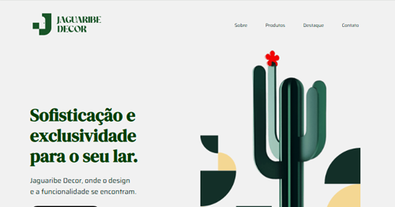

# Jaguaribe Decor

## IFPB-CSTSI / Projeto PW2
### Desenvolvimento de webpage para uma loja de decoração

#### Tecnologias Utilizadas
- **HTML5** - Estrutura semântica da aplicação
- **CSS3** - Estilização avançada e animações
- **Tailwind CSS** - Framework CSS utilitário
- **JavaScript (ES6+)** - Interatividade e funcionalidades
- **Vite** - Ferramenta de build e desenvolvimento
- **GitHub Pages** - Hospedagem e deploy

#### Funcionalidades Principais
- Catálogo de produtos de decoração
- Sistema de carrinho de compras
- Gestão de clientes
- Navegação entre páginas
- Design responsivo

#### Link da Aplicação: 
[https://michelgft.github.io/Jaguaribe_Decor/](https://michelgft.github.io/Jaguaribe_Decor/)
