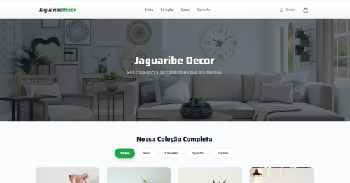

# Jaguaribe Decor

## IFPB-CSTSI / Projeto PW2
### Aplicação web completa para uma loja de decoração

#### Sobre o Projeto
O Jaguaribe Decor é uma aplicação web moderna desenvolvida para uma loja de decoração, oferecendo uma experiência completa de e-commerce com catálogo de produtos, carrinho de compras e sistema de gerenciamento integrado.

#### Tecnologias Utilizadas
- **Next.js 14** - Framework React para aplicações web modernas
- **React 18** - Biblioteca para construção de interfaces
- **JavaScript ES6+** - Linguagem de programação principal
- **Tailwind CSS** - Framework CSS para design responsivo
- **Supabase** - Plataforma de backend com banco de dados e autenticação
- **PostgreSQL** - Banco de dados relacional
- **Vercel** - Plataforma de hospedagem e deploy

#### Funcionalidades
- **Catálogo de Produtos** - Navegação por categorias de decoração
- **Carrinho de Compras** - Adição e remoção de produtos em tempo real
- **Autenticação de Usuários** - Sistema de login e cadastro seguro
- **Gestão de Clientes** - Perfis de usuários e histórico de compras
- **Painel Administrativo** - Controle de produtos e pedidos
- **Sistema de Pedidos** - Processo completo de compra
- **Upload de Imagens** - Gerenciamento de fotos dos produtos
- **Design Responsivo** - Compatível com todos os dispositivos

#### Link da Aplicação
- **Aplicação online:** https://jaguaribe-decor.vercel.app